# C Programming Lab Report

This  file contains **experiment-wise** and **question-wise** placeholders for:

* Algorithm
* Code
* Output Screenshots


---

# **Experiment 1: Installation, Environment Setup and Basics**

## **1. Print "Hello World"**

### **Algorithm:**
1. Hello World

Start

Print "Hello World"

Stop

### **Code:**
#include <stdio.h>

int main() {
    printf("Hello World\n");
    return 0;
}


### **Output Screenshot:**
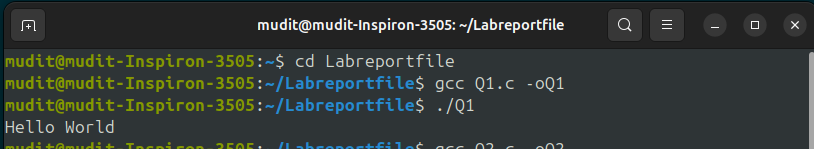


---

## **2. Print address in multiple lines**

### **Algorithm:**
Start

Print address line-by-line

Stop


### **Code:**
#include <stdio.h>

int main() {
    printf("House No. 12\nRamnagar road\nBareilly\nUttar pradesh\nIndia\n");
    return 0;
}


### **Output Screenshot:**
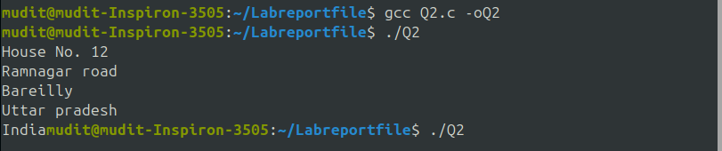

---

## **3. Program to input name and age**

### **Algorithm:**
Start

Read name, age

Print them

Stop


### **Code:**
#include <stdio.h>

int main() {
    char name[50];
    int age;

    printf("Enter your name: ");
    scanf("%49s", name);   // reads one word name

    printf("Enter your age: ");
    scanf("%d", &age);

    printf("\nYour Name: %s", name);
    printf("\nYour Age : %d\n", age);

    return 0;
}


### **Output Screenshot:**
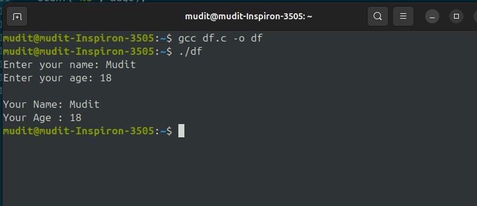
---

## **4. Add two numbers (user input)**

### **Algorithm:**
Start

Read a, b

Sum = a + b

Print sum

Stop


### **Code:**
#include <stdio.h>

int main() {
    int a, b, sum;
    printf("Enter two numbers: ");
    scanf("%d %d", &a, &b);

    sum = a + b;

    printf("Sum = %d", sum);
    return 0;
}


### **Output Screenshot:**
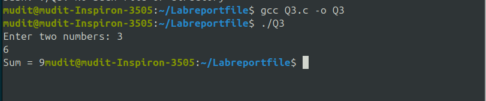
---

# **Experiment 2: Operators**

## **1. Area & Perimeter of Rectangle**

### Algorithm:
Start

Read length, width

Area = l × w

Peri = 2 × (l + w)

Print results

Stop

### Code:
#include <stdio.h>

int main() {
    float length, width;
    printf("Enter length and width: ");
    scanf("%f %f", &length, &width);

    printf("Area = %.2f\n", length * width);
    printf("Perimeter = %.2f\n", 2 * (length + width));
    return 0;
}

### Output:

---

## **2. Celsius to Fahrenheit**

### Algorithm:
Start

Read C

F = (C × 9/5) + 32

Print F

Stop


### Code:
#include <stdio.h>

int main() {
    float c, f;
    printf("Enter temperature in Celsius: ");
    scanf("%f", &c);

    f = (c * 9.0/5.0) + 32;

    printf("Fahrenheit = %.2f", f);
    return 0;
}


### Output:
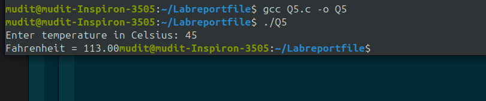
---

# **Experiment 3.1: Conditional Statements**

## **1. Triangle Validity & Type**

### Algorithm:
Read a, b, c

If a+b>c & b+c>a & c+a>b → valid

If all equal → equilateral

Else if any two equal → isosceles

Else if Pythagoras holds → right

Else → scalene

Stop

### Code:
#include <stdio.h>

int main() {
    int a, b, c;

    printf("Enter three sides of triangle: ");
    scanf("%d %d %d", &a, &b, &c);

    // Check validity
    if (a + b > c && a + c > b && b + c > a) {
        printf("Triangle is VALID\n");

        // Check type
        if (a == b && b == c) {
            printf("Triangle is EQUILATERAL\n");
        }
        else if (a == b || b == c || a == c) {
            printf("Triangle is ISOSCELES\n");
        }
        else if ((a * a == b * b + c * c) ||
                 (b * b == a * a + c * c) ||
                 (c * c == a * a + b * b)) {
            printf("Triangle is RIGHT ANGLED\n");
        }
        else {
            printf("Triangle is SCALENE\n");
        }
    } 
    else {
        printf("Triangle is NOT VALID\n");
    }

    return 0;
}


### Output:
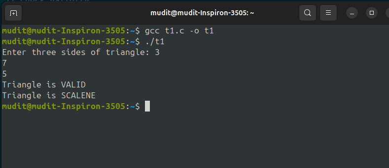
---

## **2. BMI Calculator**

### Algorithm:
Read weight, height

BMI = w/(h×h)

Compare BMI range → print category

Stop

### Code:
#include <stdio.h>

int main() {
    float weight, height, bmi;

    printf("Enter weight (kg): ");
    scanf("%f", &weight);

    printf("Enter height (m): ");
    scanf("%f", &height);

    bmi = weight / (height * height);
    printf("BMI = %.2f\n", bmi);

    if (bmi < 15)
        printf("Category: Starvation");
    else if (bmi >= 15.1 && bmi <= 17.5)
        printf("Category: Anorexic");
    else if (bmi >= 17.6 && bmi <= 18.5)
        printf("Category: Underweight");
    else if (bmi >= 18.6 && bmi <= 24.9)
        printf("Category: Ideal");
    else if (bmi >= 25 && bmi <= 25.9)
        printf("Category: Overweight");
    else if (bmi >= 30 && bmi <= 39.9)
        printf("Category: Obese");
    else if (bmi >= 40)
        printf("Category: Morbidly Obese");

    return 0;
}


### Output:
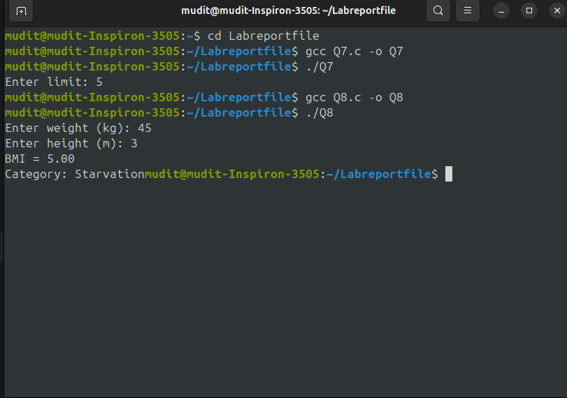
---

## **3. Check Collinearity of 3 points**

### Algorithm:
Read (x1,y1), (x2,y2), (x3,y3)

Compute area = x1(y2−y3)+x2(y3−y1)+x3(y1−y2)

If area == 0 → collinear

Else not

Stop

### Code:
#include <stdio.h>

int main() {
    float x1, y1, x2, y2, x3, y3;

    printf("Enter point1 (x1 y1): ");
    scanf("%f %f", &x1, &y1);

    printf("Enter point2 (x2 y2): ");
    scanf("%f %f", &x2, &y2);

    printf("Enter point3 (x3 y3): ");
    scanf("%f %f", &x3, &y3);

    if ((x2 - x1)*(y3 - y1) == (y2 - y1)*(x3 - x1))
        printf("Points are Collinear");
    else
        printf("Points are NOT Collinear");

    return 0;
}


### Output:
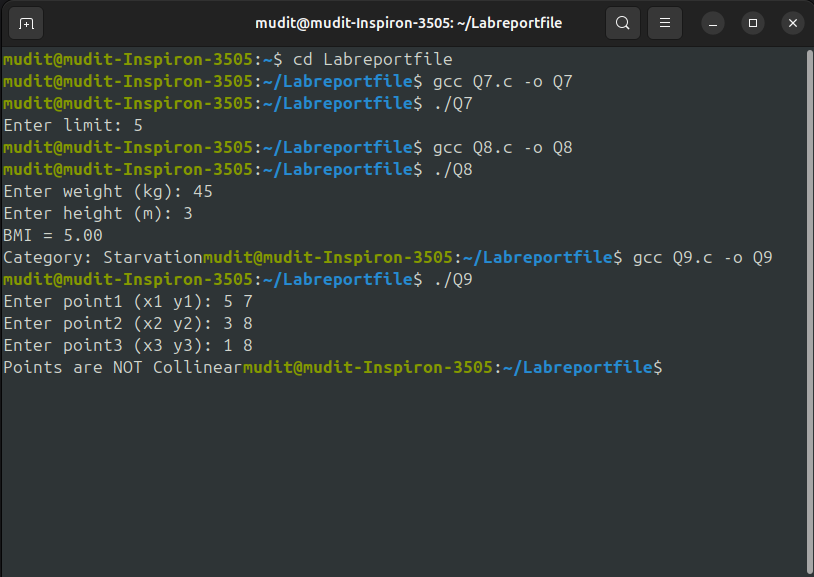
---

## **4. Day of 1st January for a Year**

### Algorithm:
Read year

Count total days passed from 01/01/01

day = days % 7

Print corresponding day

Stop

### Code:#include <stdio.h>

int main() {
    int year, leap, normal, total, day;

    printf("Enter year: ");
    scanf("%d", &year);

    leap = (year - 1) / 4 - (year - 1) / 100 + (year - 1) / 400;
    normal = (year - 1) - leap;

    total = normal * 365 + leap * 366;
    day = total % 7;

    printf("1 January %d is: ", year);

    switch(day) {
        case 0: printf("Monday"); break;
        case 1: printf("Tuesday"); break;
        case 2: printf("Wednesday"); break;
        case 3: printf("Thursday"); break;
        case 4: printf("Friday"); break;
        case 5: printf("Saturday"); break;
        case 6: printf("Sunday"); break;
    }

    return 0;
}


### Output:
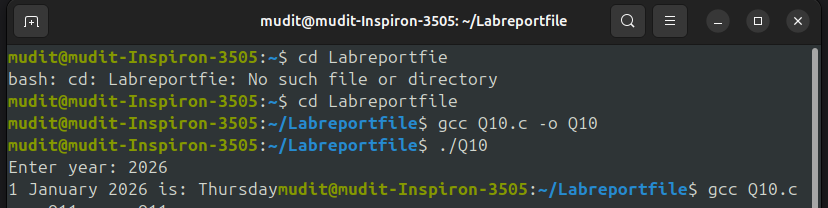
---

## **5. Ternary Operator – Largest Perimeter**

### Algorithm:
Read lengths & breadths of 3 rectangles

Compute perimeters

Compare using ternary to find largest

Print result

Stop

### Code:
#include <stdio.h>

int main() {
    int l1, b1, l2, b2, l3, b3;
    int p1, p2, p3;

    printf("Enter length and breadth of rectangle 1: ");
    scanf("%d %d", &l1, &b1);

    printf("Enter length and breadth of rectangle 2: ");
    scanf("%d %d", &l2, &b2);

    printf("Enter length and breadth of rectangle 3: ");
    scanf("%d %d", &l3, &b3);

    p1 = 2 * (l1 + b1);
    p2 = 2 * (l2 + b2);
    p3 = 2 * (l3 + b3);

    int max = (p1 > p2) ? (p1 > p3 ? p1 : p3) : (p2 > p3 ? p2 : p3);

    printf("Highest Perimeter = %d", max);

    return 0;
}


### Output:
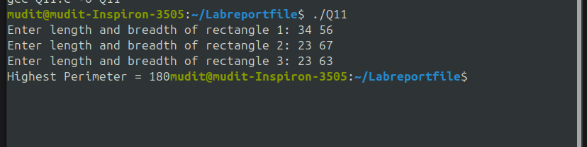
---

# **Experiment 3.2: Loops**

## **1. Count positive, negative, zero**

### Algorithm:
Loop until user stops

Read number

Increment positive/negative/zero count

End loop

Print counts

Stop


### Code:
#include <stdio.h>

int main() {
    int num, pos = 0, neg = 0, zero = 0;
    char choice;

    do {
        printf("Enter a number: ");
        scanf("%d", &num);

        if (num > 0)
            pos++;
        else if (num < 0)
            neg++;
        else
            zero++;

        printf("Do you want to continue (y/n)? ");
        scanf(" %c", &choice);

    } while (choice == 'y' || choice == 'Y');

    printf("Positive: %d\n", pos);
    printf("Negative: %d\n", neg);
    printf("Zeros: %d\n", zero);

    return 0;
}


### Output:
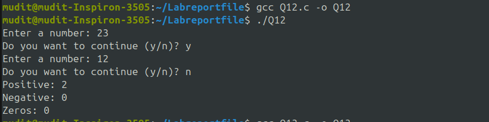
---

## **2. Multiplication Table**

### Algorithm:
2. Multiplication table

Read n

For i=1 to 10 print n×i

Stop


### Code:
#include <stdio.h>

int main() {
    int n;
    printf("Enter a number: ");
    scanf("%d", &n);

    for (int i = 1; i <= 10; i++) {
        printf("%d * %d = %d\n", n, i, n * i);
    }

    return 0;
}


### Output:
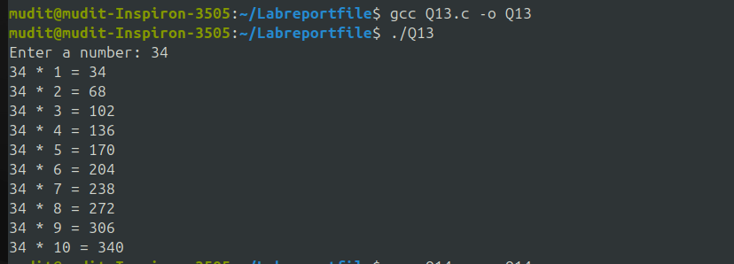
---

## **3. Pattern 1 2 3 ...**

### Algorithm:
3. Pattern 1

num=1

For rows 1→3

Print row numbers sequentially

Stop


### Code:
#include <stdio.h>

int main() {
    int num = 1;

    for (int i = 1; i <= 3; i++) {
        for (int j = 1; j <= i; j++) {
            printf("%d ", num);
            num++;
        }
        printf("\n");
    }

    return 0;
}


### Output:
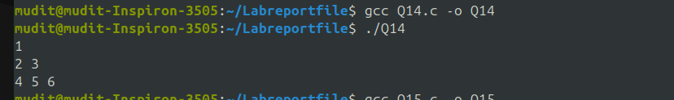
---

## **4. Pascal-like Triangle**

### Algorithm:
For rows 0→n

Compute nCr for each column

Print

Stop

### Code:
#include <stdio.h>

int main() {
    int n = 5;

    for (int i = 0; i < n; i++) {
        int val = 1;

        for (int k = 0; k < n - i - 1; k++)
            printf(" ");

        for (int j = 0; j <= i; j++) {
            printf("%d ", val);
            val = val * (i - j) / (j + 1);
        }

        printf("\n");
    }

    return 0;
}


### Output:
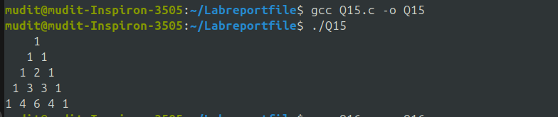
---

## **5. Population growth (10 years)**

### Algorithm:
pop=100000

For 10 years: pop = pop × 1.1

Print pop per year

Stop

### Code:
#include <stdio.h>

int main() {
    float population = 100000;

    for (int year = 1; year <= 10; year++) {
        population = population + (population * 0.10);
        printf("Year %d population = %.0f\n", year, population);
    }

    return 0;
}


### Output:
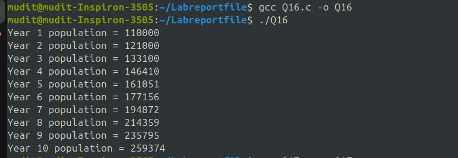
---

## **6. Ramanujan Numbers**

### Algorithm:
Loop a,b,c,d within limit

If a³+b³ == c³+d³ and pair different → print

Stop
### Code:
#include <stdio.h>

int main() {
    int L = 20;

    for (int a = 1; a <= L; a++) {
        for (int b = a + 1; b <= L; b++) {
            for (int c = 1; c <= L; c++) {
                for (int d = c + 1; d <= L; d++) {
                    if (a*a*a + b*b*b == c*c*c + d*d*d) {
                        printf("%d = %d^3 + %d^3 = %d^3 + %d^3\n",
                               a*a*a + b*b*b, a, b, c, d);
                    }
                }
            }
        }
    }

    return 0;
}


### Output:
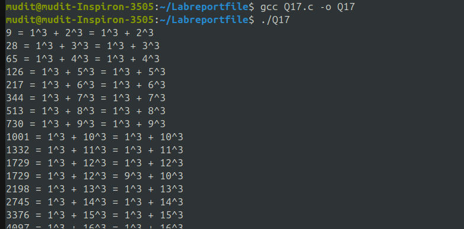
---

# **Experiment 4: Variable Scope**

## **1. Global variable demonstration**

### Algorithm:
Declare global

Access in functions

Observe accessibility

Stop

### Code:
#include <stdio.h>

int g = 10;  // global variable

void show() {
    printf("Inside function, g = %d\n", g);
}

int main() {
    printf("In main, g = %d\n", g);
    show();
    return 0;
}


### Output:
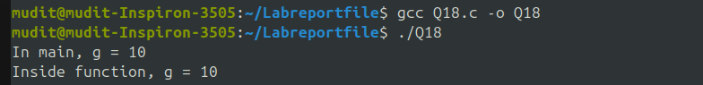
---

## **2. Local variable demonstration**

### Algorithm:
Declare local inside function

Try access outside → error

Compare with global

Stop

### Code:
#include <stdio.h>

void test() {
    int x = 5;   // local variable
    printf("Inside test, x = %d\n", x);
}

int main() {
    test();
    // printf("%d", x);  // invalid: x not accessible here
    return 0;
}


### Output:
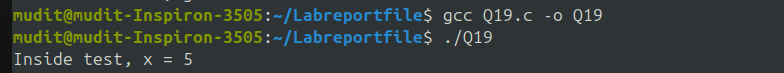
---

## **3. Block scope demonstration**

### Algorithm:
Declare inside {}

Test access inside/outside

Stop
### Code:
#include <stdio.h>

int main() {
    {
        int a = 10;
        printf("Inside block, a = %d\n", a);
    }
    // printf("%d", a); // invalid: a only exists inside block

    return 0;
}


### Output:
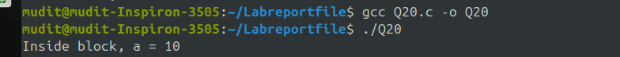
---

## **4. Static variable demonstration**

### Algorithm:
Declare static in function

Call function multiple times

Observe preserved value

Stop
### Code:
#include <stdio.h>

void count() {
    static int x = 0;  // retains value
    x++;
    printf("x = %d\n", x);
}

int main() {
    count();
    count();
    count();
    return 0;
}


### Output:
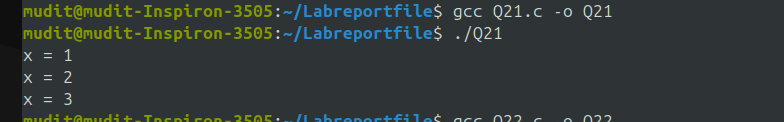
---

# **Experiment 5: Arrays**

## **1. Second largest integer**

### Algorithm:
Read array

Find largest & second largest

Print second largest

Stop


### Code:
#include <stdio.h>

int main() {
    int n;
    printf("Enter number of elements: ");
    scanf("%d", &n);

    int a[n];
    printf("Enter elements:\n");
    for (int i = 0; i < n; i++) {
        scanf("%d", &a[i]);
    }

    int largest = a[0], second = -999999;

    for (int i = 1; i < n; i++) {
        if (a[i] > largest) {
            second = largest;
            largest = a[i];
        } else if (a[i] > second && a[i] != largest) {
            second = a[i];
        }
    }

    printf("Second Largest = %d", second);

    return 0;
}


### Output:
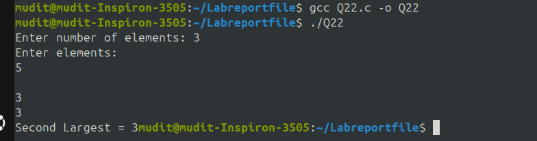
---

## **2. Count pos/neg/odd/even**

### Algorithm:
2. Count +, –, odd, even

Read array

Loop: check number type

Maintain counters

Print

Stop


### Code:
#include <stdio.h>

int main() {
    int n, i, pos = 0, neg = 0, odd = 0, even = 0;

    printf("Enter number of elements: ");
    scanf("%d", &n);

    int a[n];

    printf("Enter %d integers:\n", n);
    for (i = 0; i < n; i++) {
        scanf("%d", &a[i]);

        if (a[i] > 0) pos++;
        else if (a[i] < 0) neg++;
        if (a[i] % 2 == 0) even++;
        else odd++;
    }

    printf("Positive: %d\n", pos);
    printf("Negative: %d\n", neg);
    printf("Odd: %d\n", odd);
    printf("Even: %d\n", even);

    return 0;
}


### Output:

---

## **3. Frequency of a number**

### Algorithm:
3. Frequency of number

Read array & key

Loop & count matches

Print count

Stop


### Code:
#include <stdio.h>

int main() {
    int n, key, i, count = 0;

    printf("Enter number of elements: ");
    scanf("%d", &n);

    int a[n];

    printf("Enter array elements:\n");
    for (i = 0; i < n; i++)
        scanf("%d", &a[i]);

    printf("Enter number to find frequency: ");
    scanf("%d", &key);

    for (i = 0; i < n; i++)
        if (a[i] == key)
            count++;

    printf("Frequency of %d = %d\n", key, count);

    return 0;
}


### Output:
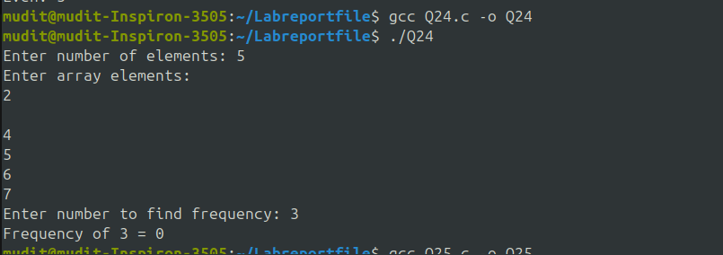
---

## **4. Matrix multiplication**

### Algorithm:
4. Matrix multiplication

Read A(m×n), B(p×q)

If n≠p → incompatible

Else multiply

Print matrices

Stop

### Code:
#include <stdio.h>

int main() {
    int m, n, p, q;
    int i, j, k;

    printf("Enter order of matrix A (m n): ");
    scanf("%d %d", &m, &n);

    printf("Enter order of matrix B (p q): ");
    scanf("%d %d", &p, &q);

    if (n != p) {
        printf("Matrix multiplication not possible. Incompatible sizes.\n");
        return 0;
    }

    int A[m][n], B[p][q], C[m][q];

    printf("Enter matrix A elements:\n");
    for (i = 0; i < m; i++)
        for (j = 0; j < n; j++)
            scanf("%d", &A[i][j]);

    printf("Enter matrix B elements:\n");
    for (i = 0; i < p; i++)
        for (j = 0; j < q; j++)
            scanf("%d", &B[i][j]);

    // Initialize C
    for (i = 0; i < m; i++)
        for (j = 0; j < q; j++)
            C[i][j] = 0;

    // Multiply
    for (i = 0; i < m; i++)
        for (j = 0; j < q; j++)
            for (k = 0; k < n; k++)
                C[i][j] += A[i][k] * B[k][j];

    // Print matrices
    printf("\nMatrix A:\n");
    for (i = 0; i < m; i++) {
        for (j = 0; j < n; j++)
            printf("%d ", A[i][j]);
        printf("\n");
    }

    printf("\nMatrix B:\n");
    for (i = 0; i < p; i++) {
        for (j = 0; j < q; j++)
            printf("%d ", B[i][j]);
        printf("\n");
    }

    printf("\nResultant Matrix C (A x B):\n");
    for (i = 0; i < m; i++) {
        for (j = 0; j < q; j++)
            printf("%d ", C[i][j]);
        printf("\n");
    }

    return 0;
}


### Output:
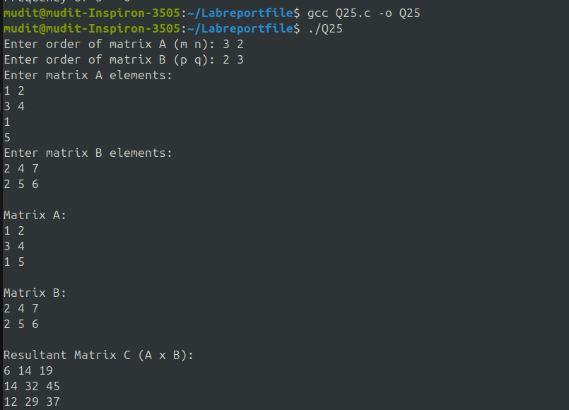
---

# **Experiment 6: Functions**

## **1. Recursive & Non-Recursive Factorial + Binomial Coefficient**

### Algorithm:
Get n,r

Compute factorials

nCr = n!/(r!×(n−r)!)

Display

Stop


### Code:
#include <stdio.h>

// Recursive factorial
int FACT_rec(int n) {
    if (n == 0)
        return 1;
    return n * FACT_rec(n - 1);
}

// Non-recursive factorial
int FACT_nonrec(int n) {
    int fact = 1, i;
    for (i = 1; i <= n; i++)
        fact *= i;
    return fact;
}

int main() {
    int n, r;
    printf("Enter n and r: ");
    scanf("%d %d", &n, &r);

    if (r > n) {
        printf("Invalid! r cannot be greater than n.\n");
        return 0;
    }

    int n_fact = FACT_rec(n);
    int r_fact = FACT_rec(r);
    int nr_fact = FACT_rec(n - r);

    int C = n_fact / (r_fact * nr_fact);

    printf("Using recursion: %dC%d = %d\n", n, r, C);
    printf("Using loop FACT: %dC%d = %d\n",
           n, r,
           FACT_nonrec(n) / (FACT_nonrec(r) * FACT_nonrec(n - r)));

    return 0;
}


### Output:
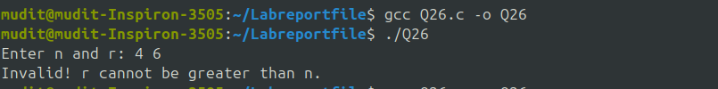
---

## **2. Recursive GCD**

### Algorithm:
2. GCD (recursive)

If b==0 return a

Else return GCD(b, a%b)

Stop

:
#include <stdio.h>

int FIBO(int num) {
    if (num == 0) return 0;
    if (num == 1) return 1;
    return FIBO(num - 1) + FIBO(num - 2);
}

int main() {
    int num;
    printf("Enter a number: ");
    scanf("%d", &num);

    printf("Fibonacci sequence up to %d:\n", num);
    for (int i = 0; i < num; i++) {
        printf("%d ", FIBO(i));
    }

    return 0;
}


### Output:
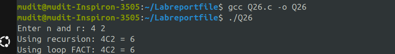
---

## **3. Recursive Fibonacci**

### Algorithm:
3. Fibonacci

Read n

Recursively print fib(n)

Stop


### Code

### Code:
#include <stdio.h>

int ISPRIME(int num) {
    if (num <= 1) return 0;

    for (int i = 2; i * i <= num; i++) {
        if (num % i == 0)
            return 0;
    }

    return 1;
}

int main() {
    int start, end;
    printf("Enter start of range: ");
    scanf("%d", &start);
    printf("Enter end of range: ");
    scanf("%d", &end);

    printf("Prime numbers between %d and %d:\n", start, end);

    for (int i = start; i <= end; i++) {
        if (ISPRIME(i))
            printf("%d ", i);
    }

    return 0;
}


### Output:
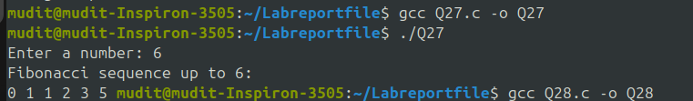
---

## **4. Prime number range (ISPRIME)**

### Algorithm:
4. Prime check

Read range

For each number call ISPRIME()

Print primes

Stop


### Code:
#include <stdio.h>
#include <string.h>

void REVERSE(char str[]) {
    int len = strlen(str);
    for (int i = 0; i < len / 2; i++) {
        char temp = str[i];
        str[i] = str[len - i - 1];
        str[len - i - 1] = temp;
    }
}

int main() {
    char str[100];

    printf("Enter a string: ");
    scanf("%s", str);

    REVERSE(str);

    printf("Reversed string: %s\n", str);

    return 0;
}


### Output:
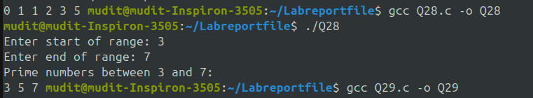
---

## **5. Reverse a String**

### Algorithm:
Read string

Pass to REVERSE function

Reverse using loop

Print

Stop
### Code:
#include <stdio.h>

typedef struct {
    float real;
    float imag;
} Complex;

Complex readComplex() {
    Complex c;
    printf("Enter real part: ");
    scanf("%f", &c.real);
    printf("Enter imaginary part: ");
    scanf("%f", &c.imag);
    return c;
}

void printComplex(Complex c) {
    printf("%.2f + %.2fi\n", c.real, c.imag);
}

Complex addComplex(Complex a, Complex b) {
    Complex result;
    result.real = a.real + b.real;
    result.imag = a.imag + b.imag;
    return result;
}

Complex subComplex(Complex a, Complex b) {
    Complex result;
    result.real = a.real - b.real;
    result.imag = a.imag - b.imag;
    return result;
}

int main() {
    Complex c1, c2, sum, diff;

    printf("Enter first complex number:\n");
    c1 = readComplex();

    printf("Enter second complex number:\n");
    c2 = readComplex();

    sum = addComplex(c1, c2);
    diff = subComplex(c1, c2);

    printf("\nFirst Complex Number: ");
    printComplex(c1);

    printf("Second Complex Number: ");
    printComplex(c2);

    printf("\nAddition: ");
    printComplex(sum);

    printf("Subtraction: ");
    printComplex(diff);

    return 0;
}


### Output:
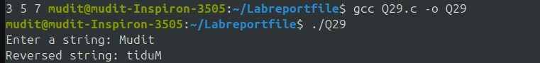
---

# **Experiment 7: Structures & Union**

## **1. Complex Number Operations**

### Algorithm:
1. Complex number operations

Read two complex numbers

Add/sub components

Print result

Stop


### Code:
#include <stdio.h>

int main() {
    char name[100][50];
    float basic[100], da, gross;

    printf("Enter details of 100 employees:\n");

    for (int i = 0; i < 100; i++) {
        printf("\nEmployee %d Name: ", i + 1);
        scanf("%s", name[i]);

        printf("Employee %d Basic Pay: ", i + 1);
        scanf("%f", &basic[i]);
    }

    printf("\n---- Gross Salary of Employees ----\n");
    for (int i = 0; i < 100; i++) {
        da = 0.52 * basic[i];
        gross = basic[i] + da;

        printf("Name: %s\tGross Salary: %.2f\n", name[i], gross);
    }

    return 0;
}


### Output:
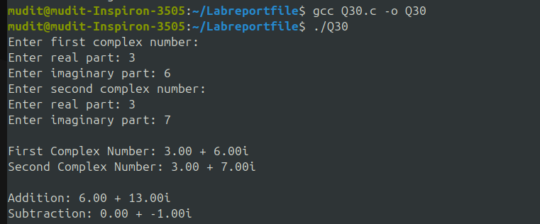
---

## **2. Monthly Pay of 100 Employees**

### Algorithm:
2. Employee salary

For 100 employees read name & basic

DA=0.52×basic

Gross=basic+DA

Print name & gross

Stop


### Code:
#include <stdio.h>

struct Book {
    int book_id;
    char title[50];
    char author[50];
    float price;
};

void printBook(struct Book b) {
    printf("\n---- Book Details ----\n");
    printf("Book ID    : %d\n", b.book_id);
    printf("Title      : %s\n", b.title);
    printf("Author     : %s\n", b.author);
    printf("Price      : %.2f\n", b.price);
}

int main() {
    struct Book b;

    printf("Enter Book ID: ");
    scanf("%d", &b.book_id);

    printf("Enter Book Title: ");
    scanf("%s", b.title);

    printf("Enter Author Name: ");
    scanf("%s", b.author);

    printf("Enter Price: ");
    scanf("%f", &b.price);

    printBook(b);

    return 0;
}


### Output:
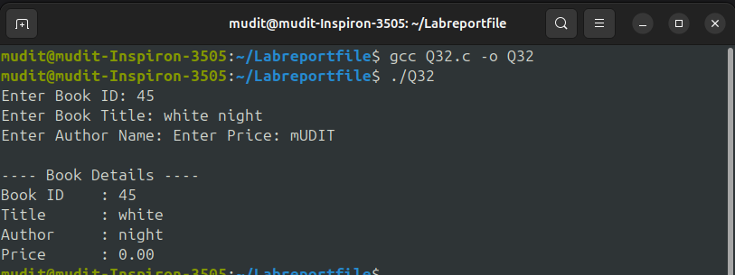
---

## **3. Book Structure (Function Argument)**

### Algorithm:
3. Book structure

Read structure fields

Pass to function

Print details

Stop

4

### Code:
#include <stdio.h>
#include <string.h>

union Address {
    char name[50];
    char home_address[100];
    char hostel_address[100];
    char city[50];
    char state[50];
    char zip[10];
};

int main() {
    union Address addr;

    // Store your present address (example: home address)
    strcpy(addr.home_address, "Sector 12, Delhi");

    printf("Present Address: %s\n", addr.home_address);

    return 0;
}


### Output:
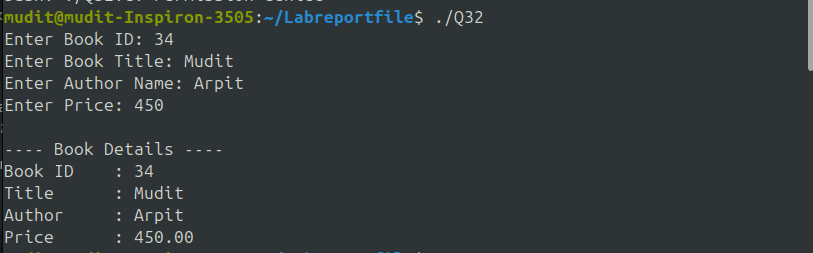
---

## **4. Union – Present Address**

### Algorithm:
. Union for address

Store one address field in union

Print present address

Stop

### Code:
#include <stdio.h>

int main() {
    int a = 10;
    float b = 5.5;
    char c = 'X';

    int *p1 = &a;
    float *p2 = &b;
    char *p3 = &c;

    printf("Integer value: %d, Pointer: %p, Value via pointer: %d\n", a, (void*)p1, *p1);
    printf("Float value: %.2f, Pointer: %p, Value via pointer: %.2f\n", b, (void*)p2, *p2);
    printf("Char value: %c, Pointer: %p, Value via pointer: %c\n", c, (void*)p3, *p3);

    return 0;
}


### Output:
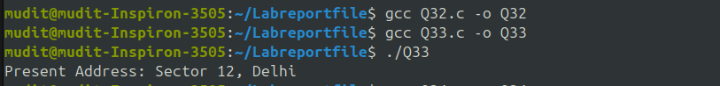
---

# **Experiment 8: Pointers**

## **1. Pointer Declaration & Access**

### Algorithm:
Declare and print pointers

Declare variables

Assign pointer addresses

Print pointer & value

Stop


### Code:
#include <stdio.h>

int main() {
    int x = 10;
    float y = 3.14;
    char z = 'A';

    int *pi = &x;
    float *pf = &y;
    char *pc = &z;

    printf("Original Addresses:\n");
    printf("pi = %p\n", (void*)pi);
    printf("pf = %p\n", (void*)pf);
    printf("pc = %p\n", (void*)pc);

    pi++; pf++; pc++;
    printf("\nAfter Increment:\n");
    printf("pi = %p\n", (void*)pi);
    printf("pf = %p\n", (void*)pf);
    printf("pc = %p\n", (void*)pc);

    pi--; pf--; pc--;
    printf("\nAfter Decrement (Back to original):\n");
    printf("pi = %p\n", (void*)pi);
    printf("pf = %p\n", (void*)pf);
    printf("pc = %p\n", (void*)pc);

    return 0;
}


### Output:
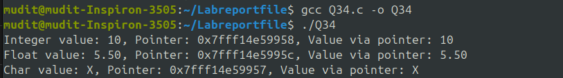
---

## **2. Pointer Arithmetic**

### Algorithm:
2. Pointer arithmetic

Declare pointer

Increment/decrement

Print addresses

Stop


### Code:
#include <stdio.h>

void update(int *a, float *b, char *c) {
    *a = *a + 5;
    *b = *b * 2;
    *c = 'Z';
}

int main() {
    int x = 10;
    float y = 4.5;
    char z = 'A';

    printf("Before update: x=%d, y=%.2f, z=%c\n", x, y, z);

    update(&x, &y, &z);

    printf("After update:  x=%d, y=%.2f, z=%c\n", x, y, z);

    return 0;
}


### Output:
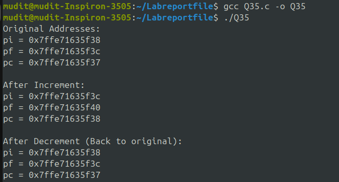
---

## **3. Function using pointers (Call by Reference)**

### Algorithm:
3. Pass by reference

Function modifies variables via pointers

Print updated values

Stop

### Code:
#include <stdio.h>

int main() {
    FILE *fp = fopen("data.txt", "w");

    if (fp == NULL) {
        printf("Error creating file.\n");
        return 1;
    }

    fprintf(fp, "This is a test file.\nWelcome to file handling in C.\n");

    fclose(fp);
    printf("File created and data written.\n");

    return 0;
}


### Output:
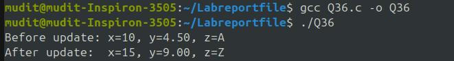
---

# **Experiment 9: File Handling**

## **1. Create and write to file**

### Algorithm:
1. Create & write file

Open file in write mode

Write text

Close

Stop

2
### Code:
#include <stdio.h>

int main() {
    FILE *fp = fopen("data.txt", "r");
    char ch;

    if (fp == NULL) {
        printf("File not found.\n");
        return 1;
    }

    printf("File Content:\n");

    while ((ch = fgetc(fp)) != EOF) {
        putchar(ch);
    }

    fclose(fp);
    return 0;
}


### Output:
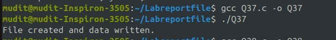
---

## **2. Read file character by character**

### Algorithm:
. Read char-by-char

Open file

Loop read each char

Print

Close

Stop


### Code:
#include <stdio.h>

int main() {
    FILE *fp = fopen("data.txt", "r");
    char line[200];

    if (fp == NULL) {
        printf("File not found.\n");
        return 1;
    }

    printf("File Lines:\n");

    while (fgets(line, sizeof(line), fp)) {
        printf("%s", line);
    }

    fclose(fp);
    return 0;
}


### Output:
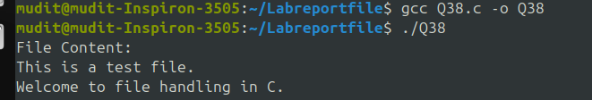
---

## **3. Read file line by line**

### Algorithm:
3. Read line-by-line

Open file

While fgets → print

Close

Stop


### Code:
#include <stdio.h>
#include <stdlib.h>

struct Node {
    int data;
    struct Node *next;
};

int main() {
    struct Node *head = NULL, *second = NULL, *third = NULL;

    head = (struct Node *)malloc(sizeof(struct Node));
    second = (struct Node *)malloc(sizeof(struct Node));
    third = (struct Node *)malloc(sizeof(struct Node));

    head->data = 10;
    head->next = second;

    second->data = 20;
    second->next = third;

    third->data = 30;
    third->next = NULL;

    struct Node *temp = head;

    printf("Linked List: ");
    while (temp != NULL) {
        printf("%d ", temp->data);
        temp = temp->next;
    }

    return 0;
}


### Output:
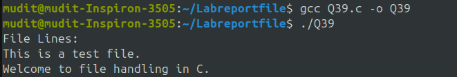
---

# **Experiment 10: Dynamic Memory Allocation**

## **1. Simple Linked List**

### Algorithm:
1. Create linked list

Allocate node

Assign data

Link nodes

Print list

Stop


### Code:
#include <stdio.h>
#include <stdlib.h>

struct Node {
    int data;
    struct Node *next;
};

int main() {
    struct Node *head = NULL, *midNode = NULL;

    head = (struct Node *)malloc(sizeof(struct Node));
    struct Node *second = (struct Node *)malloc(sizeof(struct Node));
    struct Node *third = (struct Node *)malloc(sizeof(struct Node));

    head->data = 10;
    head->next = second;

    second->data = 20;
    second->next = third;

    third->data = 30;
    third->next = NULL;

    midNode = (struct Node *)malloc(sizeof(struct Node));
    midNode->data = 15;

    midNode->next = second;
    head->next = midNode;

    struct Node *temp = head;
    printf("Linked List after insertion: ");

    while (temp != NULL) {
        printf("%d ", temp->data);
        temp = temp->next;
    }

    return 0;
}


### Output:
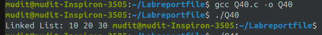
---

## **2. Insert in Middle of Linked List**

### Algorithm:
2. Insert in middle

Traverse to position

Allocate new node

Adjust links

Stop


### Code:
#include <stdio.h>

int main() {
    int a = 5, b = 3;

    printf("a AND b = %d\n", a & b);
    printf("a OR b  = %d\n", a | b);
    printf("NOT a   = %d\n", ~a);

    return 0;
}


### Output:
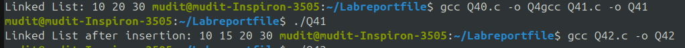
---

# **Experiment 11: Bitwise Operators**

## **1. OR, AND, NOT**

### Algorithm:
Experiment 11 (Bitwise)
1. OR, AND, NOT

Read numbers

Compute bitwise ops

Print results

Stop

2. Left & right shift

Read number

num<<1, num>>1

Print

Stop


### Code:
#include <stdio.h>

int main() {
    int x = 5;

    printf("x << 1 = %d\n", x << 1);
    printf("x << 2 = %d\n", x << 2);

    printf("x >> 1 = %d\n", x >> 1);
    printf("x >> 2 = %d\n", x >> 2);

    return 0;
}


### Output:
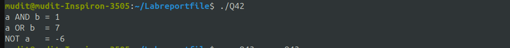
---

## **2. Left & Right Shift**

### Algorithm:


2. Left & right shift

Read number

num<<1, num>>1

Print

Stop


### Code:
#include <stdio.h>
#define PI 3.14
#define MAX 100

int main() {
    printf("PI = %.2f\n", PI);
    printf("MAX = %d\n", MAX);

    return 0;
}


### Output:
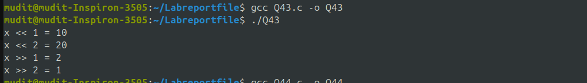
---

# **Experiment 12: Preprocessor & Directives**

## **1. Define Constants**

### Algorithm:
Experiment 12 (Preprocessor)
1. Define constant

Use #define

Print constant

Stop

2. Macro function

Define macro function

Call it

Print result

Stop
### Code:
#include <stdio.h>

#define SQUARE(x) (x * x)

int main() {
    int n = 5;
    printf("Square = %d\n", SQUARE(n));
    return 0;
}


### Output:
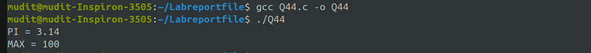
---

## **2. Function-like Macro**

### Algorithm:
2. Macro function

Define macro function

Call it

Print result

Stop

### Code:
#include <stdio.h>

#define ADD(a,b) (a + b)
#define SUB(a,b) (a - b)
#define MUL(a,b) (a * b)
#define DIV(a,b) (a / b)

int main() {
    int x = 20, y = 5;

    printf("ADD = %d\n", ADD(x, y));
    printf("SUB = %d\n", SUB(x, y));
    printf("MUL = %d\n", MUL(x, y));
    printf("DIV = %d\n", DIV(x, y));

    return 0;
}


### Output:
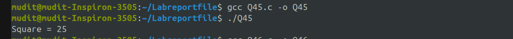
---

# **Experiment 13: Macros**

## **Arithmetic Macros**

### Algorithm:
Experiment 13 (Macros)
1. Arithmetic macros

Define ADD, SUB, MUL, DIV

Call macros

Print results

Stop

### Code:
#include<stdio.h>
int main(){

// arith.h
#ifndef ARITH_H
#define ARITH_H

int add(int a, int b);
int sub(int a, int b);
int mul(int a, int b);
float divide(float a, float b);

#endif
return 0;
}

### Output:
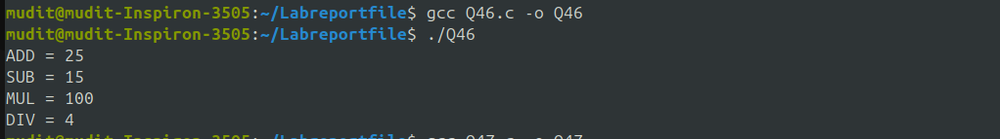
---

# **Experiment 14: Static Library**

## **1. Create Static Library**

### Algorithm:
Create static library

Write arithmetic functions

Compile to .o

Archive using ar

Stop


### Code:
/* ============================================
   arith.h  (Header for arithmetic functions)
   ============================================ */
#ifndef ARITH_H
#define ARITH_H

int add(int a, int b);
int sub(int a, int b);
int mul(int a, int b);
float divide(float a, float b);

#endif

/* ============================================
   arith.c (Functions to be added to library)
   ============================================ */
#include "arith.h"

int add(int a, int b) { return a + b; }
int sub(int a, int b) { return a - b; }
int mul(int a, int b) { return a * b; }
float divide(float a, float b) 
{
    if (b == 0)
        return 0;
    return a / b;
}

/* ============================================
   main.c (Program that uses the static library)
   ============================================ */
#include <stdio.h>
#include "arith.h"

int main() {
    int a = 20, b = 5;

    printf("Addition: %d\n", add(a, b));
    printf("Subtraction: %d\n", sub(a, b));
    printf("Multiplication: %d\n", mul(a, b));
    printf("Division: %.2f\n", divide(a, b));

    return 0;
}

/* ==========================================================
   COMPILATION STEPS FOR STATIC LIBRARY (write in assignment)
   ==========================================================

   Step 1: Compile arithmetic functions
       gcc -c arith.c

   Step 2: Create static library (.a file)
       ar rcs libarith.a arith.o

   Step 3: Compile program using library
       gcc main.c -L. -larith -o static_app

   Step 4: Run
       ./static_app

   ========================================================== */

### Output:
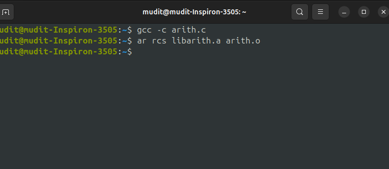
---

## **2. Use Static Library**

### Algorithm:
2. Use static library

Include header

Link .a file

Call functions

Stop


### Code:
/* ============================================
   arith.h  (Header file for static library)
   ============================================ */
#ifndef ARITH_H
#define ARITH_H

int add(int a, int b);
int sub(int a, int b);
int mul(int a, int b);
float divide(float a, float b);

#endif

/* ============================================
   arith.c (Static library source code)
   ============================================ */
#include "arith.h"

int add(int a, int b) { return a + b; }
int sub(int a, int b) { return a - b; }
int mul(int a, int b) { return a * b; }
float divide(float a, float b) { return b == 0 ? 0 : a / b; }

/* ============================================
   main_static.c (Program using static library)
   ============================================ */
#include <stdio.h>
#include "arith.h"

int main() {
    int a = 10, b = 5;

    printf("Addition: %d\n", add(a, b));
    printf("Subtraction: %d\n", sub(a, b));
    printf("Multiplication: %d\n", mul(a, b));
    printf("Division: %.2f\n", divide(a, b));

    return 0;
}

/* ==========================================================
   COMMANDS TO CREATE AND USE STATIC LIBRARY (copy into file)
   ==========================================================

   Step 1: Compile arithmetic functions
       gcc -c arith.c

   Step 2: Create static library (.a)
       ar rcs libarith.a arith.o

   Step 3: Compile main program with library
       gcc main_static.c -L. -larith -o staticApp

   Step 4: Run
       ./staticApp
   ========================================================== */

### Output:
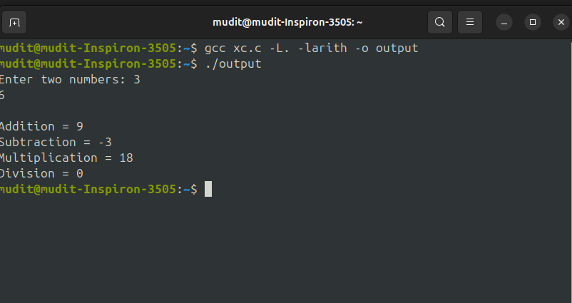
---

# **Experiment 15: Shared Library**

## **1. Create Shared Library**

### Algorithm:
. Create shared library

Write functions

Compile with -fPIC

Create .so file

Stop


### Code:
/* ============================================
   arith.h (Header file for shared library)
   ============================================ */
#ifndef ARITH_H
#define ARITH_H

int add(int a, int b);
int sub(int a, int b);
int mul(int a, int b);
float divide(float a, float b);

#endif

/* ============================================
   arith_shared.c (Shared library source code)
   ============================================ */
#include "arith.h"

int add(int a, int b) { return a + b; }
int sub(int a, int b) { return a - b; }
int mul(int a, int b) { return a * b; }
float divide(float a, float b) { return (b == 0 ? 0 : a / b); }

/* ==========================================================
   COMMANDS TO CREATE SHARED LIBRARY (copy into file)
   ==========================================================

   Step 1: Compile as position-independent code
       gcc -fPIC -c arith_shared.c

   Step 2: Create shared library (.so)
       gcc -shared -o libarith.so arith_shared.o

   ========================================================== */

### Output:

---

## **2. Use Shared Library**

### Algorithm:
2. Use shared library

Include header

Compile with -l<name>

Call functions

Stop

### Code:
/* ============================================
   main_shared.c (Program using shared library)
   ============================================ */
#include <stdio.h>
#include "arith.h"

int main() {
    int a = 12, b = 4;

    printf("Addition: %d\n", add(a, b));
    printf("Subtraction: %d\n", sub(a, b));
    printf("Multiplication: %d\n", mul(a, b));
    printf("Division: %.2f\n", divide(a, b));

    return 0;
}

/* ==========================================================
   COMMANDS TO USE SHARED LIBRARY (copy into file)
   ==========================================================

   Step 1: Compile main program
       gcc main_shared.c -L. -larith -o sharedApp

   Step 2: Set library path
       export LD_LIBRARY_PATH=.:$LD_LIBRARY_PATH

   Step 3: Run
       ./sharedApp
   ========================================================== */

### Output:

---

# **End of Report**


```
